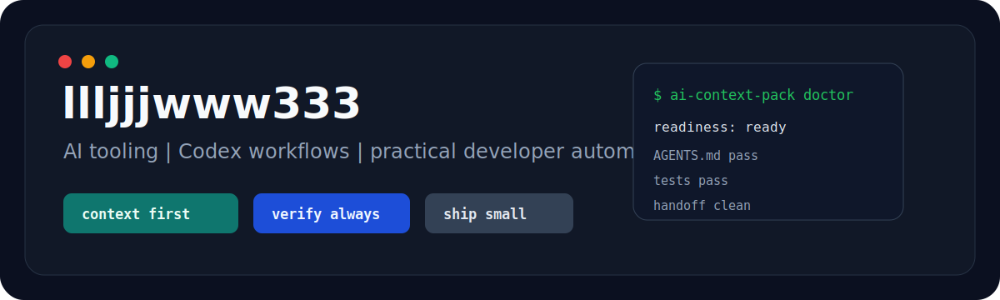

# Hi, I'm llljjjwww333

<p align="center">
  
</p>

<p align="center">
  <a href="https://github.com/llljjjwww333"></a>
  <a href="https://github.com/llljjjwww333/ai-context-pack"></a>
  
  
</p>

<p align="center">
  Building practical AI-assisted developer tools, repo automation, and clean handoff workflows.
  <br />
  做实用的 AI 开发者工具，把复杂项目整理成更容易理解、验证和交接的形态。
</p>

---

## Current Direction

I like tools that reduce friction before the hard work starts: better repository context, better validation loops, better prompts, and smaller handoffs between humans and coding agents.

| Area | What I care about |
| --- | --- |
| AI developer tools | Context engineering, Codex workflows, agent-ready repositories |
| Automation | CLI utilities, repeatable checks, clean local workflows |
| Open source | Small useful tools with clear docs and low setup cost |
| Engineering style | Practical, testable, maintainable, not overbuilt |

## Featured Work

<table>
  <tr>
    <td width="50%">
      <h3><a href="https://github.com/llljjjwww333/ai-context-pack">AI Context Pack</a></h3>
      <p>Generate Codex-ready <code>AGENTS.md</code>, AI context reports, handoff prompts, and readiness checks for any repository.</p>
      <p>
        
        
        
      </p>
    </td>
    <td width="50%">
      <h3>Codex contribution workflow</h3>
      <p>Working with forked repositories, issue-driven fixes, patch handoffs, and small PR-sized changes.</p>
      <p>
        
        
        
      </p>
    </td>
  </tr>
</table>

## Toolkit

<p>
  
  
  
  
  
  
</p>

## How I Work

```text
read the repo -> reduce ambiguity -> make a small change -> verify -> document the handoff
```

- Prefer focused tools over large vague platforms.
- Keep setup and verification commands visible.
- Treat README, tests, and CLI output as part of the product.
- Use AI to accelerate understanding, but keep the final change reviewable.

## GitHub Snapshot

<p align="center">
  
  
</p>

<p align="center">
  
</p>

## Currently Interested In

- Making repositories easier for Codex and AI coding agents to understand.
- Turning repeatable debugging and validation habits into small CLI tools.
- Improving open-source handoff quality: issue notes, patch links, tests, docs.
- Building useful utilities without unnecessary product bloat.

## Contact

- GitHub: [@llljjjwww333](https://github.com/llljjjwww333)
- Projects: [ai-context-pack](https://github.com/llljjjwww333/ai-context-pack)

<p align="center">
  
</p>

